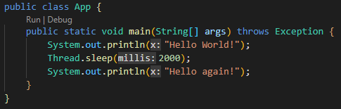
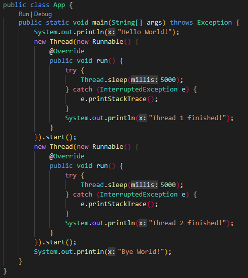
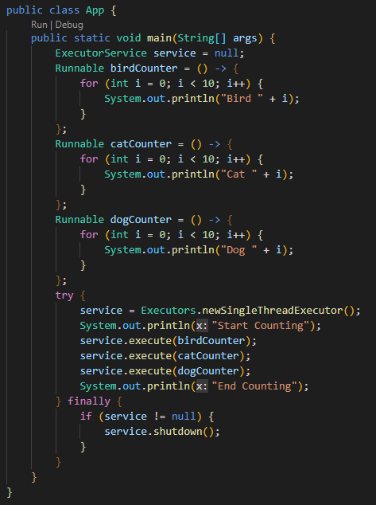
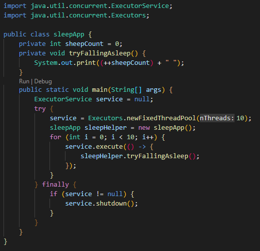
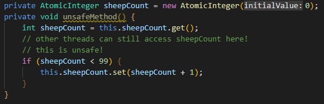
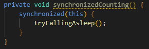
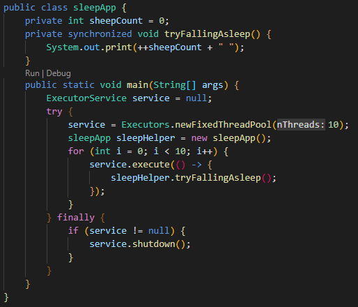

<!-- Output copied to clipboard! -->

<!-----

You have some errors, warnings, or alerts. If you are using reckless mode, turn it off to see inline alerts.
* ERRORs: 0
* WARNINGs: 0
* ALERTS: 8

Conversion time: 2.525 seconds.

Using this Markdown file:

1. Paste this output into your source file.
2. See the notes and action items below regarding this conversion run.
3. Check the rendered output (headings, lists, code blocks, tables) for proper
   formatting and use a linkchecker before you publish this page.

Conversion notes:

* Docs to Markdown version 1.0β33
* Thu Jul 21 2022 10:26:48 GMT-0700 (PDT)
* Source doc: Exercising Concurrency
* This document has images: check for >>>>>  gd2md-html alert:  inline image link in generated source and store images to your server. NOTE: Images in exported zip file from Google Docs may not appear in  the same order as they do in your doc. Please check the images!

WARNING:
You have 6 H1 headings. You may want to use the "H1 -> H2" option to demote all headings by one level.

----->

>>>>>  gd2md-html alert:  ERRORs: 0; WARNINGs: 1; ALERTS: 8.

<ul style="color: red; font-weight: bold"><li>See top comment block for details on ERRORs and WARNINGs. <li>In the converted Markdown or HTML, search for inline alerts that start with >>>>>  gd2md-html alert:  for specific instances that need correction.</ul>

Links to alert messages:
<a href="#gdcalert1">alert1</a>
<a href="#gdcalert2">alert2</a>
<a href="#gdcalert3">alert3</a>
<a href="#gdcalert4">alert4</a>
<a href="#gdcalert5">alert5</a>
<a href="#gdcalert6">alert6</a>
<a href="#gdcalert7">alert7</a>
<a href="#gdcalert8">alert8</a>

>>>>> PLEASE check and correct alert issues and delete this message and the inline alerts.

# **Concurrency**

## **Introductie**

Concurrency is een van de lastigste problemen om mee om te gaan bij het programmeren. Letterlijk vertaald betekent het gelijktijdigheid - een computer moet natuurlijk meerdere dingen tegelijkertijd kunnen doen. Maar net zoals multi-tasken bij (sommige) mensen makkelijk mis gaat, gaat ook het multi-tasken bij computers niet altijd even gemakkelijk.

Wat een mens multi-tasking noemt, noemt een computer **_Multi-Threading_**. De processor berekent steeds een klein beetje van elke actieve thread na elkaar - hierdoor lijkt het alsof de threads tegelijkertijd worden uitgevoerd. Maar 4 threads van een bepaalde maat of 1 threads van 4x die maat - is dat niet hetzelfde?

Met een enkele processor is dat inderdaad praktisch hetzelfde. Maar de waarheid van moderne processors is dat het helemaal geen “enkele” processors zijn. Zo’n 20 jaar geleden is het opgehouden met 1 processor steeds veel sneller te maken, en is er een andere trend voor in de plaats gekomen: **multi-core processors**. Dat houdt in dat computers tegenwoordig daadwerkelijk meerdere threads tegelijkertijd kunnen behandelen, en daarmee dan ook veel sneller kunnen werken.

Het opsplitsen van je werk in meerdere threads kan je applicatie dus heel veel sneller maken. Maar dit doen komt niet zonder problemen of risico - wat deze problemen zijn en hoe je dit met Java oplost gaan we in deze handout nader onderzoeken.

# **Inhoud**

1. Creating Threads in Java
    * Threads & Runnables
    * ExecutorService
2. Concurrency Pitfalls
    * Deadlock
    * Starvation
    * Livelock
    * Race Conditions
3. Thread Safety in Java
    * Atomic Classes
    * Concurrent Collections
    * Synchronized
    * Other solutions

# **Creating Threads in Java**

Threads maken en gebruiken kan in Java op heel veel verschillende manieren. Zoals je inmiddels hebt ervaren zijn er vaak oudere en nieuwere technieken die hetzelfde probleem oplossen - Concurrency is hierin geen uitzondering.

De oude manier van threads aanmaken is wel belangrijk om te kennen, omdat je het hier en daar nog zal zien. Deze werkt via de **Thread class** en de **Runnable (functional) Interface**. 

Daartegenover staat de nieuwere manier van werken met multi-threading: de **Concurrency API**. Bij deze moderne classes gebruik je de **ExecutorService class** om threads aan te maken, samen met veel andere classes/interfaces om deze threads te beheren.

## **Threads & Runnables**

Standaard zit al je code in Java in 1 thread. Je kan deze ene thread beïnvloeden via de static methods op de Thread class. Zie het voorbeeld hieronder:

Er is hiervoor geen import statement nodig - Thread is namelijk een onderdeel van de _java.lang_ package.

Je kan ook je eigen Threads aanmaken via een normale Constructor, en je kan deze thread z’n werk laten beginnen met diens start() method.

Je Thread heeft dan natuurlijk wel werk nodig om uit te voeren! Dit werk wordt als een parameter meegegeven via een implementatie van de **Runnable interface**.

Runnable is een Functional Interface, dus je kan het in principe met een lambda schrijven. Toch doen wij het nog even via een Anonymous Inner Class, om de naam van de Runnable method te demonstreren - dat is **run()**. Zie het voorbeeld hieronder:

Maak het bovenstaande voorbeeld na en controleer de volgorde van de System.out.println() methods die uitgevoerd worden. Let ook op de try/catch blocks - die zijn nodig omdat Thread.sleep() een InterruptedException kan throwen!

Misschien lijkt het nu dat je threads altijd in dezelfde volgorde uitgevoerd worden. Toch kan je hier niet altijd op rekenen - de prioriteit die Java geeft aan Threads zijn standaard vrij willekeurig. Soms worden ze gelijk uitgevoerd (zoals hier) maar als je computer veel aan het rekenen is wordt er bij de ene Thread soms meer “gewacht” dan de andere!

In principe implementeert de Thread class zelf ook Runnable, dus kan je ook de Thread class extenden. Dit wordt zo goed als nooit gedaan - vroeger werd dit alleen gedaan om de prioriteit te beïnvloeden. Als je zoiets complex wil doen bestaan er tegenwoordig veel betere manieren via de **Concurrency API**.

## **ExecutorService**

De ExecutorService class is dus de moderne manier van werken met threads. Hierbij hoef je niet elke thread aan te maken met een new Thread() of vergelijkbaar - je gebruikt de ExecutorService om deze Threads voor je aan te maken. Zie het voorbeeld hieronder:

**Maak bovenstaande voorbeeld na**. Let op het finally{} block waar de service.shutdown() method gebruikt wordt - als je dit vergeet, blijft je programma altijd draaien!

Als je dit laat uitvoeren, zal je merken dat alles nog steeds in een strakke volgorde wordt geprint. Dit komt omdat er gebruik gemaakt wordt van de **Executors.newSingleThreadExecutor()** method!

Probeer deze nu te vervangen door **ExecutorService.newFixedThreadPool(3)** en draai dezelfde code nogmaals. Welke is als eerste klaar met tellen? En als je deze code herhaaldelijk draait, is dat altijd hetzelfde?

Naast ExecutorService bestaat er ook een _ScheduledExecutorService_, en beiden hebben nog een aantal methods die we niet verder gaan behandelen. Als je de concepten goed begrijpt kan je deze details altijd nog opzoeken.

Wat wel nog belangrijk is om te onderzoeken, zijn de classes waar ExecutorService mee werkt om je threads te beheren. Die behandelen we verderop bij de opdrachten nog eventjes.

# **Concurrency Pitfalls**

Werken met concurrency is lastig. Je wil graag dat je programma sneller wordt, en onbedoeld maak je het langzamer, doet het iets onverwachts of crasht het zelfs helemaal. Dit kan komen door veel verschillende dingen, die allemaal te herleiden zijn op 4 verschillende “soorten” problemen.

Sommige van deze problemen kan je oplossen door bepaalde “concurrent classes” te gebruiken. Weer andere zijn alleen op te lossen door goed na te denken over de structuur.

De oplossingen voor deze problemen verschillen nogal per programmeertaal. **_Daarom is het veel belangrijker om de conceptuele problemen te onthouden dan de precieze oplossing!_** De 4 problemen die we willen dat je onthoudt zijn als volgt:

* **_Deadlock_**
* **_Starvation_**
* **_Livelock_**
* **_Race Conditions_**

De eerste drie hebben allemaal te maken met _Thread Liveness_. Dat houdt in dat de Thread onbedoeld niet zijn werk af kan maken.

Je kan het vergelijken met een infinite loop waarbij de rest van je programma doet alsof er niks aan de hand is - je hebt het misschien niet door, maar je computer heeft nu ruimte nodig voor taken / data die nooit “af” is!

Bij de laatste (Race Conditions) is het probleem iets anders. In plaats van dat je threads hun werk niet kunnen afmaken, gaan ze een onverwacht resultaat afleveren.

Deze problemen zijn zeer complex om in code te laten zien, dus we behandelen vooral de theorie.

## **Deadlock**

Bij _Deadlock_ is er sprake van een stilstand tussen meerdere threads. Deze threads zitten op elkaar te wachten voordat ze verder kunnen gaan.

Het bekendste “voorbeeldprobleem” van deadlock is het _Dining Philosophers Problem_. 

Stel, er zitten 5 filosofen aan tafel met elk een bord pasta. Deze filosofen zijn niet heel praktisch; ze kunnen niet overleggen en hebben allemaal 2 vorken nodig om hun pasta te eten. Helaas zijn er maar 5 vorken beschikbaar! Zie hieronder:

Elke filosoof probeert eerst de linkervork op te pakken. Dit lukt. Vervolgens gaan ze wachten tot er een rechtervork beschikbaar is. Dit gebeurt nooit, en dus zitten ze voor de rest van de tijd op elkaar te wachten.

Dit is natuurlijk niet heel realistisch, maar het is wel een goed voorbeeld van hoe dezelfde instructies aan tegelijkertijd werkende “domme programma’s” je applicatie tot stilstand kunnen brengen. De 5 filosofen zitten in een _deadlock_.

## **Starvation**

We blijven nog even bij onze 5 domme filosofen. Stel, je laat je filosofen vorken delen - nummers 1 en 2 delen een paar, en nummers 3 en 4 ook.

Helaas hebben je filosofen oneindig veel pasta en eten ze ontzettend langzaam. Zodra de eerste klaar is, wil de ander eten. Maar zodra die klaar is, heeft de eerste alweer honger!

In deze situatie krijgt de 5e filosoof dus nooit de resources die hij/zij nodig heeft om te eten. Dan maar doodgaan aan de honger met een bord pasta voor je smoel!

Niet heel realistisch dus, maar zoiets is bij een multi-threaded echt wel mogelijk. Dit probleem heet _Starvation_. Een enkele thread zit niet meer te wachten op andere threads, maar op resources die nooit beschikbaar zijn. Hierdoor blijft de thread altijd bestaan en kost deze dus altijd extra rekenruimte op de computer.

## **Livelock**

Stel: je zit in een telefoongesprek met je beste vriend(in). Jullie hebben allebei afgesproken dat je niet ophangt voordat je als laatste doei zegt. En jullie zijn allebei heel koppig!

Nu zitten jullie allebei vast in een eindeloos telefoongesprek. Het lijkt alsof jullie allebei nog iets aan het doen zijn, maar je schiet geen haar op. Dit is **_Livelock_**.

Livelock is een heel geniepig probleem om op te lossen. Als je activiteit van threads gaat zitten controleren, is deze namelijk niet automatisch te detecteren. Je threads lijken allemaal nog actief, ze boeken alleen helemaal geen vooruitgang meer.

## **Race Conditions**

Race Conditions zijn een probleem van een heel andere soort. Het lijkt alsof je programma goed werkt, en het kost niet teveel resources op je computer. Maar wanneer het resultaat eruit komt, is het misschien helemaal niet wat je verwacht!

Neem onderstaande code bijvoorbeeld:

Maak deze code na en bekijk het resultaat. Het resultaat zal niet voorspelbaar zijn!

Denk anders aan een bankrekening met 2000 euro die niet rood mag staan. Misschien komen er precies tegelijkertijd 2 betaalverzoeken binnen, eentje van 100 en eentje van 1500. Hoeveel staat er uiteindelijk op de rekening? Dat kan je niet makkelijk voorspellen!

Een grote bank kan zich natuurlijk niet veroorloven om alle betaalverzoeken een voor een te behandelen. Er moet een oplossing zijn die dit met multi-threading “veilig” kan maken!

Daarvoor moet je dus met goede _Thread Safety_ coderen.

# **Thread Safety in Java**

Met Thread Safety kan je via allerlei verschillende manieren je resources “beveiligen”. Je kan het vergelijken met een reservering bij een restaurant - zelfs als je er zelf (nog) niet bent, zorg je dat anderen niet jouw plek gaan gebruiken.

Het is overigens belangrijk om te beseffen dat Thread Safety niet alleen slaat op threads die je zelf aanmaakt. Soms worden er ook automatisch threads aangemaakt zonder dat je dat gelijk doorhebt. Dat kan gebeuren via een framework dat bijv. betalngsverzoeken automatisch gaat delegeren, maar het gebeurt ook als je de _ParallelStream_ class gebruikt.

Een reservering die niet nodig is heeft natuurlijk wel een effect op je performance, dus het is dan ook weer niet zo dat je altijd maar deze oplossingen moet gaan gebruiken. Goed doorhebben wanneer je wel en niet hierop moet leunen is een van de lastigste kanten aan programmeren.

Er zijn heel veel verschillende manieren om Thread Safety te bereiken. Wij gaan de simpelste onderzoeken, en de ingewikkelde benoemen - we verwachten namelijk niet dat je veel meer dan de simpelste nodig hebt.

## **Atomic Classes**

De _java.util.concurrent.atomic_ package heeft veel verschillende classes die _Atomic Operations_ uitvoeren. Daar kan dus niks mee gedaan worden terwijl zo’n operatie bezig is - goed om Race Conditions te vermijden!

De volgende Atomic classes zijn goed om te kennen:

* **_AtomicBoolean_**
* **_AtomicInteger_**
* **_AtomicLong_**

Er bestaat dus **geen** standaard AtomicFloat of AtomicDouble class. Heb je alsnog zoiets nodig? Dan kan je ook de AtomicReference class gebruiken, bijvoorbeeld als AtomicReference&lt;Float> of AtomicReference&lt;Double>

## **Concurrent Collections**

Concurrent Collections zijn heel vergelijkbaar aan Atomic classes. Net zoals bij normale Collections zijn er ongelofelijk veel verschillende soorten, allemaal met een hele specifieke use case. De belangrijkste om te onthouden is de **_ConcurrentHashMap_**, maar je hebt bijv. ook de _BlockingQueue_, _BlockingDequeue_, _CopyOnWriteArrayList_, _CopyOnWriteArraySet_ en nog heel veel meer.

Behalve de eerste hoef je deze verder niet te onthouden.

## **Synchronized**

Terug naar het sleepApp voorbeeld van hierboven. Als je daarbij de int sheepCount vervangt door een AtomicInteger, zal je niet zoveel verschil merken qua resultaat. Het enige wat die Atomic class voorkomt, is dat de (kleine) kans op een dubbel gebruikte waarde verdwijnt.

Dit komt omdat de alleen het moment dat de waarde uitgelezen + geupdate wordt gereserveerd is. De method _tryFallingAsleep()_ kan nog steeds door 10 verschillende threads tegelijk uitgevoerd worden!

Als je meerdere methods van een Atomic Class / Concurrent Collection gebruikt, kan het tussen die methods in nog steeds aangepast worden door een andere thread! Zie het voorbeeld hieronder:

Om dit op te lossen bestaat het keyword **_synchronized_**. Deze kan je op meerdere manieren gebruiken. Zo kan je een **_synchronized block_** maken. Deze heeft een parameter nodig die aangeeft welk Object “gereserveerd” wordt tijdens het uitvoeren van de code:

Je kan synchronized ook als keyword gebruiken voor een hele method. Zie de onderstaande gesynchroniseerde sleepApp:

Let op! Ga nou niet gelijk overal synchronized op doen, maar gebruik dit alleen wanneer het echt nodig is. Het kost je namelijk wel wat performance.

Meer lezen over het synchronized keyword? [Hier](https://www.baeldung.com/java-synchronized) een goed artikel van Baeldung.

## **Other Solutions**

Met de oplossingen hierboven kan je alle opdrachten al maken. Daarnaast bestaat er ook nog de **Lock interface** en de **CyclicBarrier class**. Locks zijn vergelijkbaar aan synchronized blocks, maar dan meer te “customizen”. 

Zo kan je meerdere synchronized blocks alleen op volgorde in gebruik nemen / loslaten - bij Locks hoeft dat niet. CyclicBarrier is voor use cases waar je wil wachten tot een bepaalde hoeveelheid threads iets hebben gedaan voordat je de eerste weer verder laat.

Je hoeft Lock en CyclicBarrier verder niet te onthouden.

# **Opdrachten Concurrency**

### **Opdracht 1** - Threading Support Classes

ExecutorService gebruikt een aantal classes ter ondersteuning. Belangrijk om te kennen zijn de enum **_TimeUnit_**, en de interfaces **_Future_** en **_Callable_**.

TimeUnit is vrij vanzelfsprekend - Future en Callable wat minder.

* Wat is het verschil tussen een Runnable en een Callable?

Eerder heb je _service.execute()_ gebruikt zien worden - deze gebruikt altijd Runnables. Daarnaast zie je ook vaak service.submit(). Deze returned een Future waarmee je de voortgang van je taak kan bijhouden, bijvoorbeeld via de _isCancelled()_ en _isDone()_ methods.

Future heeft ook twee (overloaded) methods _get()_. Eentje zonder parameters, en eentje met. Degene met parameters doet bijna hetzelfde, maar kan ook 1 andere Exception throwen die de method zonder parameters niet kan throwen.

* Welke exception is dit? Wanneer wordt deze exception gethrowed?

### **Opdracht 2** - Exiting Threads

Je hebt geleerd dat je bij een ExecutorService altijd shutdown() moet callen als je klaar bent - anders eindigt je programma nooit.

* Wat is het verschil tussen shutdown() en shutdownNow()?

De reden dat je altijd shutdown() moet callen is omdat ExecutorService ook een eigen thread gebruikt om vanaf te werken, en deze thread moet zelf ook gesloten worden. Dit is een zogeheten **_non-Daemon Thread_**.

* Wat is een Daemon Thread?