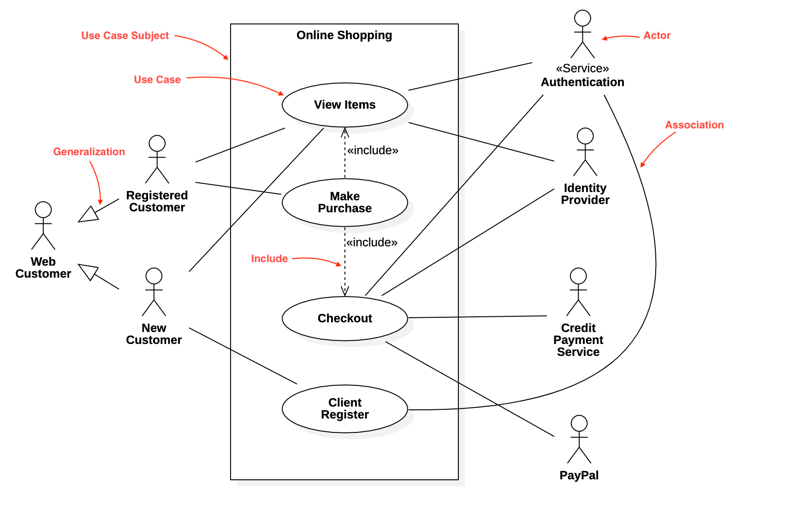
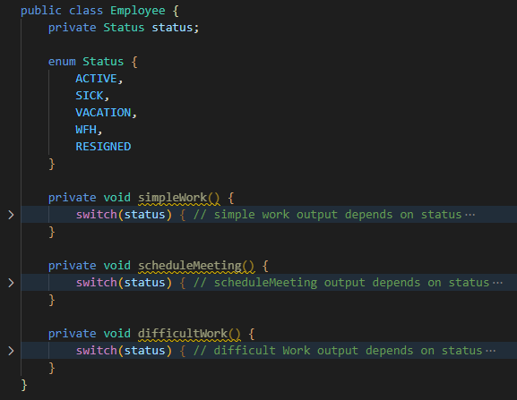

# **Data Models & Design Patterns**

## **Introductie**

Programmeren komt in essentie altijd neer op patroonherkenning. Je werkt met data in bepaalde structuren, en gebruikt code om die structuren automatisch uit te lezen. 

Hoe deze data aangeleverd wordt verschilt natuurlijk veel. Soms is het een .txt of .csv bestand, en soms is het een GET/POST Request die bij je server binnenkomt. Misschien is het zelfs een geautomatiseerd proces dat eerst zelf de data opzoekt, via Github bijvoorbeeld. 

Er zit dus niet alleen een patroon in de data die je gebruikt, maar ook in het soort problemen dat je met programmeren wil oplossen. Als je een goede oplossing hebt voor een bepaald soort probleem, kan je die oplossing waarschijnlijk hergebruiken bij vergelijkbare problemen.

Dit is de essentie van **_Design Patterns_** - best practices die je kan gebruiken om bij een bepaald soort probleem een “schets” van de oplossing te maken. En wij willen natuurlijk graag dat jij dit soort goede oplossingen kan gebruiken voor je eigen problemen!

Denk even terug aan HTML; specifiek aan de navbar die je op meeste websites ziet. Dat is een goede oplossing voor elke website met meerdere pagina’s. Je kan je makkelijk voorstellen hoe zoiets eruit zou zien, zelfs zonder een specifiek voorbeeld. Desnoods kan je het met pen/papier tekenen!

Maar hoe ziet een schets van een Design Pattern eruit? Hoe “teken” je Objects en Classes? Dat doe je via een zogeheten _Modeling Language_. Verreweg de bekendste hiervan is **UML - Unified Modeling Language**. Bekend zijn met de basis van UML is een must als je met OOP talen wil gaan werken.

# **Inhoud**

1. UML
    * Use Case Diagram
    * Sequence Diagram
    * Class Diagram
    * Entity Relationship Diagram
2. Design Patterns
    * Singleton Pattern
    * Builder Pattern
    * Facade Pattern
    * Strategy Pattern
    * Decorator Pattern
    * MVC Pattern

# **UML**

Zoals je hierboven hebt gelezen staat UML voor _Unified Modeling Language_. Het eerste woord daarvan is het benadrukken waard - UML is namelijk niet altijd precies hetzelfde!

Dit komt omdat UML een manier is om data en processen in een bepaald diagram te laten zien. Deze diagrammen zijn er in veertien verschillende soorten! Je kan al deze soorten zien als dialecten van de taal UML.

Hier een weergave van deze 14 soorten, getekend in UML:

Veertien verschillende dialecten leren is natuurlijk ontzettend veel. En dat is ook helemaal niet nodig - het overgrote deel ervan kom je zo weinig tegen, dat het de moeite niet waard is.

Welke diagrammen zijn dan wel de moeite waard? Wij verwachten dat je de **_Use Case Diagram_** en de **_Sequence Diagram_** hoogstwaarschijnlijk wel tegen zal komen. Maar er is er ook eentje die je gegarandeerd vaker zal zien: de **_Class Diagram_**. Die drie gaan we dus nader onderzoeken.

## **Use Case Diagram**

Een Use Case Diagram is een weergave van een use case voor bepaalde software. Het toont de processen en stappen die de gebruikers van je software doorlopen om tot een gewenst resultaat te komen. Zie hieronder een voorbeeld:

Het fijne aan UML is dat het zichzelf vaak vrij goed uitlegt - wie er betrokken is bij het proces van Online Shopping en wat ze moeten doen is vrij duidelijk.

Minder duidelijk is wat de verschillende soorten pijltjes en lijnen betekenen - zonder rode text ter uitleg was het waarschijnlijk niet helder!

Dit soort verbanden tussen Classes / Objects (en Actors) worden ook wel **_dependencies_** genoemd. Bij Class Diagrams gaan we verder in op de verschillende soorten dependencies.

Kijk [dit filmpje](https://www.youtube.com/watch?v=zid-MVo7M-E) en oefen daarna voor jezelf door een simpel Use Case Diagram te maken. Gebruik hierbij het proces van de TechGrounds opleiding.

## **Sequence Diagram**

Een Sequence Diagram is een weergave van de stappen die een  proces doorloopt tussen bepaalde classes of netwerken. Een voorbeeld: 

Aan het bovenstaande kan je zien dat er een method getBalance(accountNumber) wordt gebruikt om bij een Bank object data op te vragen. 

Dit Bank object vraagt eerst aan een AccountLedger object om een bepaalde CheckingAccount op basis van de accountNumber, en vraagt vervolgens aan deze CheckingAccount wat diens saldo is.

Een Sequence Diagram gebruikt veel termen die je misschien niet bij andere diagrammen tegen gaat komen - [hier](https://developer.ibm.com/articles/the-sequence-diagram/) een artikel erover van IBM, en [hier](https://www.youtube.com/watch?v=pCK6prSq8aw) een goed filmpje met uitleg.

Zorg dat je de volgende concepten van een Sequence Diagram kent:

* Lifelines
* Messages
* Alternatives

## **Class Diagram**

Een Class Diagram is, zoals de naam al suggereert, een manier om verschillende classes en hun relaties tot elkaar te tonen. Een enkele class in een Class Diagram kan er zo uitzien:

Het voorbeeld hierboven is de UML weergave van onderstaande class:

Je ziet dus de class naam, attributes en methods - altijd in die volgorde. Let ook goed op de + en - tekentjes die public / private aanduiden!

Af en toe zie je UML weergave die wat van dit soort details weglaat, en alleen een beschrijving van de attributes en methods weergeeft. Meeste Class Diagrams laten die details niet weg, maar we willen je er wel voor waarschuwen. Zie het voorbeeld hieronder:

Wat in het voorbeeld hierboven wel goed is weergegeven, zijn de relaties tussen verschillende classes. Zo zijn Corporate/Personal Customer duidelijk subclasses van Customer, en dit wordt ook met de goede soort pijl aangegeven.

Order, Order Line en Customer zijn natuurlijk geen subclasses van elkaar - maar ze maken wel gebruik van elkaar. Naast de lijn geven ze ook met een getal-waarde aan in welke hoeveelheid dat is:

* Elke Order Line hoort bij 1 Order, maar een Order mag meerdere Order Lines hebben
* Elke Order hoort bij 1 Customer, maar een Customer mag meerdere Orders hebben.

Deze relatie heet ook wel een **_association_** - elke Order Line is geassocieerd met 1 Order, en elke Order is geassocieerd met 1 Customer. 

Meer weten over Class Diagrams? [Hier](https://www.youtube.com/watch?v=UI6lqHOVHic) een goed filmpje

## **Dependencies**

Een associatie is een soort relatie tussen classes. Ook Inheritance is zo’n soort relatie, hoe raar dat misschien ook klinkt. Ruw gezegd zijn ze onder te verdelen in 3 categorieen:

* IS-A (Inheritance)
* HAS-A (Composition + Aggregation)
* USES-A (Association + Dependency)

Ja, er is dus een dependency/relatie die gewoon “Dependency” heet. Wij maken de regels helaas niet zelf! Hieronder een goede weergave:

Meer lezen over dependencies? [Hier](http://blog.rcard.in/programming/oop/software-engineering/2017/04/10/dependency-dot.html) een goed artikel.

Bedenk voor jezelf een voorbeeld van elke soort relatie tussen classes die je bij een Techgrounds IT-systeem tegen zou kunnen komen.

# **Design Patterns**

Design Patterns kan je zien als een soort verzameling van _best practices_. Elk design pattern is toepasbaar op een bepaalde situatie/probleem, en beschrijft een algemene aanpak die makkelijk gemaakte fouten vermijdt / goed schaalbaar is.

Het concept is geïntroduceerd in een boek uit 1994, genaamd **[Design Patterns: Elements of Reusable Object Oriented Software](https://en.wikipedia.org/wiki/Design_Patterns)**. Hoewel er sindsdien natuurlijk veel nieuwe zijn bedacht, zijn de 23 originele die in dat boek staan beschreven nog steeds heel toonaangevend. De vier auteurs staan ook wel bekend als de **Gang of Four (GoF)**.

Het is best veel droge theorie - toch is het belangrijk om deze concepten te kennen. Niet alleen zal je het herkennen in de naamgeving van classes in bestaande code, het zal je ook helpen om zelf makkelijk vermijdbare fouten te ontwijken en schaalbare code te schrijven. 

Gelukkig hoef je niet per se zo’n dik boek te lezen om over Design Patterns te leren:

* [Refactoring.guru](https://refactoring.guru/) is verreweg de beste bron van online uitleg
* [Tutorialspoint](https://www.tutorialspoint.com/design_pattern/index.htm) heeft ook best veel goede voorbeelden

Zelfs als je niet elk design pattern heel vaak gebruikt is het nog steeds heel leerzaam. Het behandelen en onderzoeken van deze design patterns zal je een beter idee geven waar goede en duidelijke code nou eigenlijk uit bestaat.

De 23 GoF patterns zijn onder te verdelen in 3 categorieën**. **23 patterns is natuurlijk wel veel om gelijk mee te beginnen. Daarom gaan we in deze handout focussen op de volgende 6:

* Singleton
* Builder
* Facade
* Strategy
* Factory
* Decorator
* **MVC - M**odel **V**iew **C**ontroller

MVC is geen Gang of Four Pattern, maar wordt wel dermate veel gebruikt dat het het benoemen waard is.

Onderzoek nu zelf het verschil tussen de 3 categorieën van GoF Patterns:

* **Creational Patterns**
* **Structural Patterns** 
* **Behavioral Patterns**

## **Singleton Pattern**

Het Singleton Pattern is een van de simpelste design patterns om te begrijpen. Het beschrijft de situatie dat je altijd maar 1 enkele instantie van een class wil hebben. Dit lijkt misschien vrij simpel, maar toch is het zonder gebruik van dit pattern makkelijk om er fouten mee te maken. Denk aan de volgende problemen:

* Hoe zorg je dat je Constructor maar 1 keer gebruikt wordt?
* Hoe zorg je dat elke andere class naar dezelfde instantie van een Singleton class refereert, zelfs als deze niet is aangemaakt?

Hieronder zie je de implementatie van het Singleton Pattern in UML:

De constructor van een Singleton class wordt private gemaakt, en slechts 1x gebruikt om een private static field in te vullen. Vervolgens wordt er een public getInstance() method toegevoegd die altijd de waarde van deze static field teruggeeft.

Als je een makkelijk voorbeeld van de code van het Singleton Pattern wil zien, kan je die [hier op Tutorialspoint](https://www.tutorialspoint.com/design_pattern/singleton_pattern.htm) vinden.

Lees de bovenstaande link goed door en zorg dat je de volgende vragen kan beantwoorden:

* Wat is het verschil tussen Lazy Initialization en Eager Initialization?
* Welke van de 2 wordt er bij het voorbeeld op Tutorialspoint gebruikt?

## **Builder Pattern**

Het Builder Pattern wordt gebruikt om complexe Constructors makkelijker in gebruik te maken. Denk aan een class Pizza met 10 optionele ingrediënten - moet je dan een aparte Constructor maken voor elke mogelijke combinatie?

Zelfs als je in die situatie een enkele Constructor gebruikt met default parameters wordt het makkelijk om ze door elkaar te halen. En wat dan als je extra ingrediënten toe gaat voegen? Dan moet je de volgorde in je Constructor onthouden en ook alle plekken waar je de Constructor in je code gebruikt aanpassen. Kortom: heel veel werk om bestaande code te refactoren bij elke toevoeging.

En wat als je voor je Pizza class een vegetarisch alternatief wil met “dezelfde” ingredienten? Met het Builder Pattern kan je al deze problemen oplossen - dan gebruik je een aparte Builder class die dit regelt.

Vaak wordt er ook nog een Interface of Abstract Class gebruikt, zodat er makkelijk zo’n VegetarianBuilder gemaakt kan worden. Zie het voorbeeld hieronder:

Een heel goed artikel wat al deze problemen goed weergeeft en de implementatie ook in Java weergeeft kan je [hier op Dzone](https://dzone.com/articles/design-patterns-the-builder-pattern) vinden.

Er is een StringBuilder class die de Java developers hebben gemaakt die dit patroon gebruikt. Deze heeft echter geen build() method, maar wel eentje met hetzelfde effect. Hoe heet deze method?

## **Facade Pattern**

Een façade is een oud engels woord voor de voorkant van een gebouw. Het Facade Pattern beschrijft een structurele manier om je classes vorm te geven. In plaats van al je gebruikers direct te verbinden aan de benodigde subsystemen, laat je ze eerst door de voordeur van je code lopen. Een façade is dus een _wrapper class_ die gebruikt wordt om het gebruik van code te scheiden van de implementatie. 

Als je 3+ verschillende classes hebt voor betalingsmethodes (bijvoorbeeld iDeal, Mastercard en Visa) en 3+ verschillende classes hebt voor de gebruikers (bijvoorbeeld Guest, User en Premium_User) loopt je code al snel door elkaar heen. 

Wanneer je dan de code van iDeal aanpast moet je die ook bij elke gebruikers class aanpassen. Als je in plaats daarvan een class PaymentProcessor ertussenin zet, hoef je bij de gebruikers alleen een PaymentProcessor aan te maken. Zo kan je bij verdere updates veel moeite besparen omdat je de code maar op 2 plekken hoeft aan te passen.

Een goed voorbeeld met code kan je [hier op Baeldung](https://www.baeldung.com/java-facade-pattern) vinden.

## **Strategy Pattern**

Het Strategy Pattern is een beschrijft een manier dat classes zich kunnen gedragen. Net zoals bij mensen kan dit afhankelijk zijn van bepaalde context. Zie het onderstaande voorbeeld:

Met kleine verschillen in situaties en een klein aantal methods is dit nog best op te lossen met switch/case en if/else. Maar wat als je 10+ verschillende methods hebt met 10-100 regels code per status? Je class wordt dan heel snel heel onoverzichtelijk.

Het Strategy Pattern lost dit op - in plaats van de methods in de class Employee vol details te zetten, kan je een EmployeeStrategy Interface en diens implementaties gebruiken. 

Hierdoor hoeft je Employee alleen maar te bepalen WELKE logica gebruikt wordt, en hoeft het zich geen zorgen te maken over hoe die logica precies in elkaar steekt. Dit maakt je code ontzettend schaalbaar - als je later een nieuwe status toevoegt hoef je niet 10 verschillende methods in de Employee class aan te passen.

Meer weten over het Strategy Pattern? [Hier op freecodecamp](https://www.freecodecamp.org/news/the-strategy-pattern-explained-using-java-bc30542204e0/) een goed artikel. Een ander heel goed artikel dat dit uitlegt met bonus inhoud over de Factory en Null Object patterns kan je [hier op dzone](https://dzone.com/articles/design-patterns-the-strategy-and-factory-patterns) vinden.

## **MVC Pattern**

Het MVC pattern is als enige in deze handout geen onderdeel van de 23 originele GoF Patterns - technisch gesproken is het een **Architectural Pattern**. Toch is het misschien wel het belangrijkste patroon om te kennen als het om webdevelopment gaat - veel belangrijke back-end frameworks zijn ontworpen met dit patroon in gedachten.

Het MVC pattern beschrijft een onderverdeling in rollen die je bij je classes hoort te gebruiken. Het staat voor **Model**, **View**, **Controller**. Dit zijn drie verschillende maar verwante taken die je bij het MVC pattern dus moet scheiden in aparte classes.

Stel: je hebt een class User die op verzoek via de method getUserInfo() alle gebruikersinformatie uit je database moet plukken en aan de gebruiker moet tonen. Je moet rekening houden met het volgende:

* Is het verzoek van een legitieme gebruiker
* Wat voor tabellen / data is er eigenlijk allemaal in de database
* Welke data-format wordt er verwacht als reactie? Bijv JSON of XML
* Welke taal wordt er verwacht bij de reactie? Bijv. Nederlands of Engels.

Als je al die condities in je ene method stopt zal dat dus heel veel clutter zijn. Grote complexe code is een recept voor bugs - tijd om die verantwoordelijkheden op te splitsen!

Als je namelijk gebruikt maakt van het MVC Pattern, splits je je class User op in 3 classes:

* De **UserController**, die als een verkeersleider het verzoek binnen ziet komen. Die verifieert of het een legitiem verzoek is en geeft het vervolgens door aan:
* De **UserModel**, die de database verzoekt om de nodige data. Zo hoeft alleen de UserModel class te begrijpen hoe je database in elkaar steekt. Nadat de benodigde data binnen is geeft de UserModel het verzoek + bijbehorende data terug aan de UserController. Die geeft de data vervolgens weer door aan:
* De **UserView**, die de data vormgeeft qua taal en format. Vervolgens stuurt de UserView het resultaat terug naar de UserController. De UserController geeft dat resultaat weer door aan de Front-end.

Belangrijk hierbij is dat de Model en de View nooit direct data met elkaar delen - al het verkeer gaat via de verkeersleider 😊 Het maakt de Model helemaal niet uit hoe je data gepresenteerd wordt, en het maakt de View helemaal niet uit welke data nou inhoudelijk om gevraagd wordt. Deze scheiding van verantwoordelijkheid zorgt voor beter schaalbare code.

Een goede video over het MVC Pattern kan je [hier](https://www.youtube.com/watch?v=DUg2SWWK18I) vinden. 
