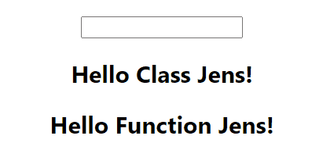
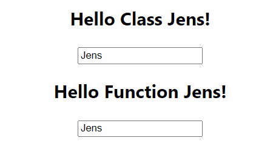
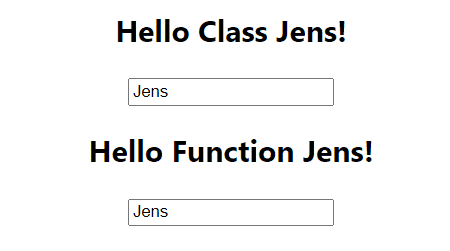
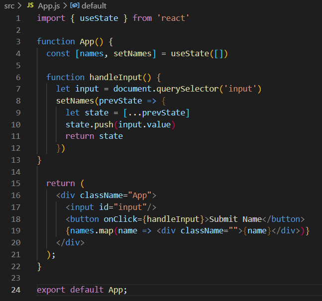
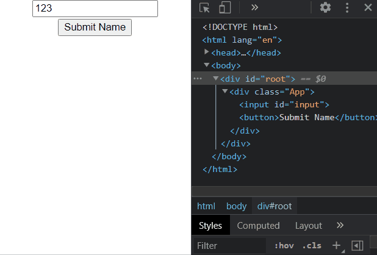
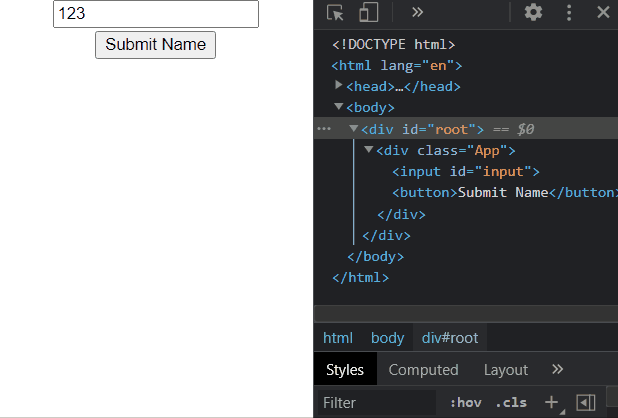
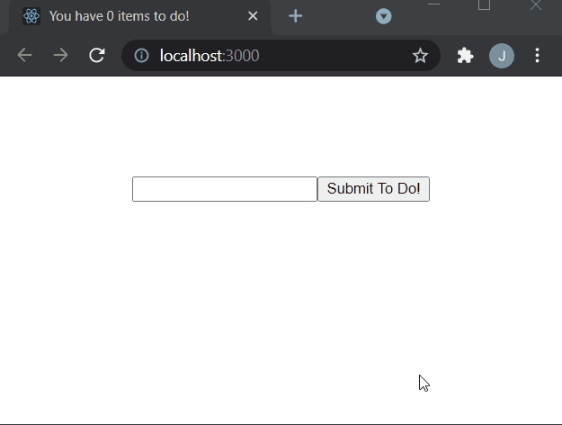

# **Starting React**

## **Introductie**

Met JavaScript kan je dynamisch de HTML op je pagina veranderen. Maar als je meerdere geneste elementen conditioneel wil tonen of veranderen wordt het met alleen JavaScript heel snel heel omslachtig. Om dit allemaal wat makkelijker te maken gebruiken moderne web developers JavaScript Frameworks. De grootste hiervan zijn **Angular**, **Vue** en **React**.

Van de “grote drie” is React de allergrootste, en mede daarom ook degene waar jullie over gaan leren. Ze zijn wel allemaal op vergelijkbare concepten gebaseerd. Het goed leren van de een zal het leren van de anderen dus veel makkelijker maken.

Die vergelijkbare concepten zijn het opsplitsen van de pagina in **componenten**, en het gebruik van een soort dialect van / uitbreiding op JavaScript. Zo’n dialect wordt ook wel een **DSL** genoemd - een **Domain Specific Language**. 

_Technisch gezien is React helemaal geen framework, maar een library. Toch wordt het heel vaak met frameworks vergeleken en daarom ook zo genoemd. De twee termen worden vaker door elkaar gebruikt. Wil je echt weten wat het verschil is? [Hier](https://www.freecodecamp.org/news/the-difference-between-a-framework-and-a-library-bd133054023f/) een goed artikel._

## **Documentatie**

Het fijne aan React leren is dat de documentatie ontzettend uitgebreid is - die kan je vinden op [reactjs.org](https://reactjs.org/). Als je net begint, kan het heel lastig zijn om te begrijpen wat zo’n technische documentatie nou precies betekent. Toch is het belangrijk om dit te oefenen! 

Uiteindelijk ga je nog veel vaker nieuwe frameworks of talen moeten leren, en dan zal de documentatie vaak minder compleet zijn. Daarom wordt er in dit document veel naar de officiële documentatie verwezen - we verwachten dan ook dat jullie je best doen om deze te begrijpen.

## **Installatie**

Om React te gebruiken, moet je het eerst installeren - je kan het vergelijken met het opzetten van een Git Repository. React kan dit alleen niet zelf - je moet het opzetten via een package manager zoals NPM. Deze installeert automatisch wanneer je **node.js** download - dat kan je [hier](https://nodejs.org/en/download/) doen.

Onzeker of je node.js / npm hebt geinstalleerd? Typ “**node -v**” en/of “**npm -v**” in je terminal om het te controleren.

React wordt praktisch altijd gecombineerd met build tools. Dat zijn hulpmiddelen die je code bijvoorbeeld efficiënter verpakken, automatisch “vertalen” naar oudere versies of op een andere manier beter maken.

Verreweg de bekendste versie van React is **Create-React-App**. Je kan dit zien als de “standaard React starter kit”. Als je (veel) verder bent met React ga je misschien over op andere tools, maar voorlopig kan je elke React app daarmee beginnen.

Create-React-App gebruik je vanaf de command-line met “**npx create-react-app &lt;project-name>**” - deze maakt dan autmoatisch een nieuwe folder met die naam aan en zet daar je React project op. Wil je een project aanmaken in de huidige folder? Gebruik dan “**npx create-react-app .**” met een puntje ipv een project-name.

Create-React-App is een gigantische package met ontzettend veel dependencies - hier krijgt het soms zelfs wat kritiek voor. Je kan gerust de **_App.test.js_**, **_reportWebVitals.js_** en **_setupTests.js_** verwijderen. CSS en logo’s mag je zelf beslissen of je die wil bewaren.

Er is overig 1 package die je heel erg vaak bij React gebruikt ziet worden, die **niet** bij Create-React-App zit. Dat is **styled-components** - een geweldige manier om je CSS te combineren met JS logica! Deze installeer je met “**npm install styled-components**”

# 1. **Componenten, JSX en ReactDOM**

De bouwblokken van elke React pagina zijn **_componenten_**. Dit zijn stukjes HTML die samen je pagina opbouwen. React componenten zijn dus blokken HTML - maar ze worden wel gecodeerd in JavaScript files! Het gebruik van HTML en JS door elkaar heen wordt ook wel **JSX** genoemd. Wil je meer weten over JSX? [Hier](https://reactjs.org/docs/introducing-jsx.html) het intro artikel en [hier](https://reactjs.org/docs/jsx-in-depth.html) het in-depth artikel.

Een component is een soort JavaScript Object. Ook React componenten worden op meerdere manieren gemaakt - er zijn **functional components** en **class components**. Vroeger was er een groot verschil qua functionaliteit, maar sinds Februari 2019 kunnen ze praktisch hetzelfde. 

Omdat functional components makkelijker geschreven zijn, is dit tegenwoordig de norm. Het  is wel een vrij recente ontwikkeling. Veel tutorials en bestaande React pagina’s zijn geschreven met class components - daarom is het van belang dat je beide leert. Je kan ze overigens ook door elkaar heen gebruiken mocht je dat willen doen.

React componenten zijn niet alleen heel gestructureerd, ze zijn ook heel efficiënt. Deze efficiëntie komt uit het feit dat React zijn eigen kopie van de DOM bijhoudt - de **ReactDOM**. Dit wordt ook wel eens de _virtual DOM_ genoemd. React vergelijkt de ReactDOM met de daadwerkelijke DOM en update hem automatisch zodra er een verschil ontstaat. Als je meer wil lezen over hoe de ReactDOM elementen op je pagina toont, kan je dat [hier](https://reactjs.org/docs/rendering-elements.html) doen.

Bij React wordt veel gesproken over **state** en **props** (properties). De properties van een component zijn door de parent doorgegeven, terwijl de state de eigen verantwoordelijkheid is van elk component. Als je bijvoorbeeld een Accordeon component maakt is de tekst en titel onderdeel van de properties, terwijl de state bepaalt of hij ingevouwen of uitgevouwen is.

De state van een component kan als props doorgegeven worden aan child componenten. Denk aan bijvoorbeeld taalinstellingen of een light/dark theme - dat kan een state zijn van je hele pagina maar beïnvloedt wel de inhoud / vormgeving van meerdere onderdelen.

# **Opdrachten Introductie**

Maak een nieuw React project aan. Verwijder de onnodige files, en voeg 2 componenten aan je App.js toe: een &lt;ClassComponent /> en een &lt;FunctionalComponent />. Elk component moet een boodschap op je scherm tonen.

Maak in je App een input element aan. Wat je in de input stopt gaan we in de state van je App bewaren. Daarvoor moet je natuurlijk wel weten hoe je de state van een component aanpast. Bij Class Componenten doe je dat met setState. Bij Functional Componenten doe je dat met de useState Hook. Als je dit niet al weet, zal je eerst zelf moeten onderzoeken hoe dat werkt.

Vervolgens gaan we de state van App doorgeven aan de componenten als props. Het resultaat moet er ongeveer zo uit zien:

Je App.js is waarschijnlijk een Functional Component - dan heb je dus Hooks gebruikt. Om te zorgen dat beiden lukt gaan we de input verplaatsen naar de componenten zelf:

# 2. **Controlled Components en Shared State**

Sommige form-elementen (zoals input) houden een eigen interne state bij, die je met een submit input kan gebruiken. Maar soms wil je de data uit zo’n element gebruiken bij een ander element. Denk aan een formulier dat sommige vragen pas weergeeft als er bij een andere vraag een bepaald antwoord is gegeven.

Als je React de waarde van een input component laat beheersen, wordt dat ook wel een **_Controlled Component_** genoemd. Eerder heb je geleerd hoe je de state van een component aan child components door kan geven. Maar wat als je die state bij een andere vraag nodig hebt? Wat als die vraag geen child component is?

Dat probleem los je op door de state naar een hogere laag te tillen. Als je de state op het hele formulier plaatst, kan je de method die de state aanpast via props doorgeven aan alle vragen. Zo kunnen ze allemaal een soort gedeelde state aanpassen en gebruiken bij hun eigen renderlogica.

# **Opdracht Shared State**

We gaan verder met de uitwerking van de vorige opdracht. Zet de state van je input element terug in de app, en zorg dat de method die deze state aanpast als props doorgegeven wordt aan beide componenten. Als je het goed doet, kan je met de input van het ene component ook de waarde van het andere component aanpassen. Maak dit na:

# 3. **Lists en Keys**

Soms heb je een onbekend aantal componenten dat je op je pagina wil tonen. Misschien heb je een onbekend aantal zoekresultaten dat je gaat weergeven. Misschien wil je de inputs van je user tonen - dan kan je niet van tevoren weten hoeveel componenten je moet tonen. Hieronder een voorbeeld van code die dit implementeert:

Er gebeurt bij deze code nogal wat - als je het niet gelijk begrijpt is dat niet erg! Probeer het langzaam regel voor regel te ontcijferen. Er is een useState hook die een array bijhoudt van wat er ingevuld wordt. En op regel 19 wordt het array gebruikt om elk item in het array op je scherm weer te geven!

De setNames method maakt een nieuw state array aan en vult deze met de inhoud van de vorige state. Als je direct prevState.push() gebruikt en die vervolgens returned, zal dit niet werken! **React rendert pas opnieuw als de state compleet verandert. Het doet dit dus niet als alleen de inhoud van een state object/array anders is.**

Het vorige voorbeeld werkt voor React redelijk efficiënt: elke keer dat er een item wordt toegevoegd, gebeurt dit onderaan de lijst. React vergelijkt de lijst van zijn ReactDOM met de echte DOM en ziet dat er alleen onderaan wat verschillend is. Vervolgens voert het deze verandering door in je browser.

Maar wat als je het nieuwste item bovenaan wil tonen? Bij het vorige voorbeeld lukt dat redelijk makkelijk door unshift() te gebruiken ipv push(). Echter betekent dit voor de ReactDOM dat bij elke verandering de hele lijst opnieuw getoond moet worden. Wat eerst de 1e div in de lijst was, wordt na toevoeging van een nieuw item de tweede. De tweede div wordt de derde enzovoorts. En deze moeten dus allemaal opnieuw gerenderd worden!

Om deze efficiëntie op te lossen maakt React gebruik van **Keys**. In plaats van elementen in een lijst te vergelijken op basis van hun positie in de DOM, worden ze vergeleken aan de hand van hun Key. Is een element met een bepaalde Key niet veranderd? Dan hoeft deze dus niet opnieuw gerenderd te worden.

Hieronder 2 voorbeelden die dit aantonen:

Bij bovenstaand voorbeeld zijn er **geen** keys gebruikt. Ook al veranderen we zelf nog wat in de DOM, elk element in de lijst wordt opnieuw geladen zodra we een nieuw item aan de lijst toevoegen.

Bij bovenstaand voorbeeld zijn **wel** keys gebruikt. Dit zorgt ervoor dat alleen het element met een nieuwe key wordt gerenderd. De elementen die wij aanpassen in de DOM worden NIET opnieuw gerenderd, en dus blijven onze veranderingen staan.

# **Opdracht Lists en Keys**

Maak het vorige voorbeeld na - een lijst met keys waarvan het laatst toegevoegde item bovenaan verschijnt.

# 4. **Side Effects en Lifecycle Methods**

Zoals je inmiddels wel door hebt kan je in React met state/props ontzettend veel bereiken. Maar niet alles zal je daarmee lukken. Wat als je event listeners toe wil voegen, of data wil verzoeken van een server? Als je dat zomaar in een component plopt zal die code draaien elke keer dat je component rendert. 50 kopieën van dezelfde event listener of hetzelfde dataverzoek is toch een stuk minder optimaal!

Dit soort taken noemt React **Side Effects**, en React heeft bepaalde methods waarbinnen ze willen dat je dit soort Side Effects laat uitvoeren. Voor Class Components zijn dit de** Lifecycle Methods**, voor Functional Components is dit de **useEffect** hook.

Lifecycle methods beschrijven het “leven” van een component op je pagina. Als een component aan je pagina wordt toegevoegd/verwijderd noemt React dit mounting/unmounting. Wil je hier meer over weten? [Hier](https://reactjs.org/docs/react-component.html) de documentatie met alle Lifecycle methods. De belangrijkste daarvan zijn als volgt:

* render()
* componentDidMount()
* componentDidUpdate()
* componentWillUnmount()

De code die je in zo'n method zet draait dus op een bepaald moment. Deze momenten zijn aan de hand van de naam gelukkig al vrij duidelijk. Er zijn wel nog meer Lifecycle methods, maar die zie je lang niet even vaak gebruikt.

useEffect is de Hook die de functionaliteit van al die Lifecycle Methods voor Functional Components vervangt. Dit betekent wel dat het een vrij complexe functie is. [Hier](https://reactjs.org/docs/hooks-effect.html) de officiële uitleg uit de documentatie.

Als je het niet al hebt gedaan, lees dan heel zorgvuldig de documentatie van Main Concepts en Hooks door. Je hoeft niet nu al te weten hoe je de andere Hooks gebruikt, maar het helpt wel als je vast een vaag concept hebt van wat ze doen.

# **To-Do Opdracht**

Een standaard opgave bij het leren van elk framework is het maken van een To-Do App; Jij gaat dit nu ook proberen. Maak het volgende na:

Vereisten:

* Gebruik Functional Components
* Gebruik styled-components ipv CSS
* Zorg dat je to-do items opgeslagen worden in localStorage
* Zorg dat je tabblad-titel het aantal to-do items aangeeft.

Als je dit kan maken heb je een goede basis met useState, useEffect & styled-components!
